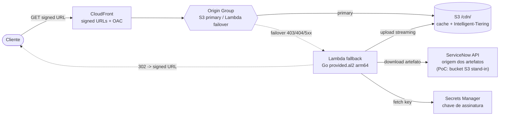
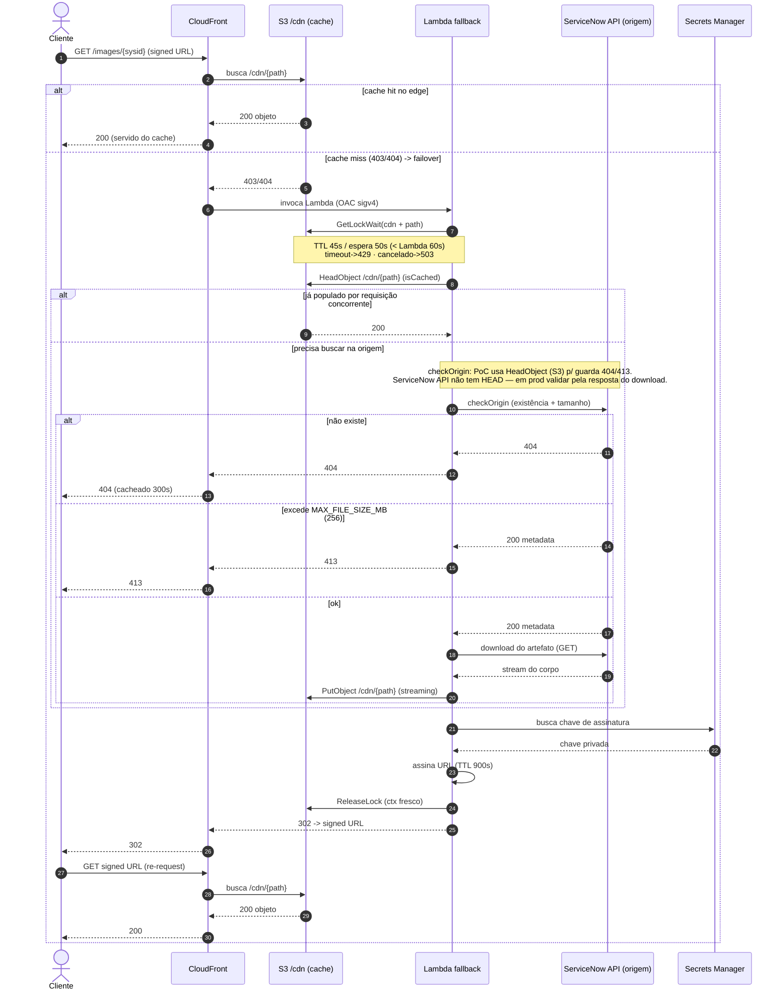
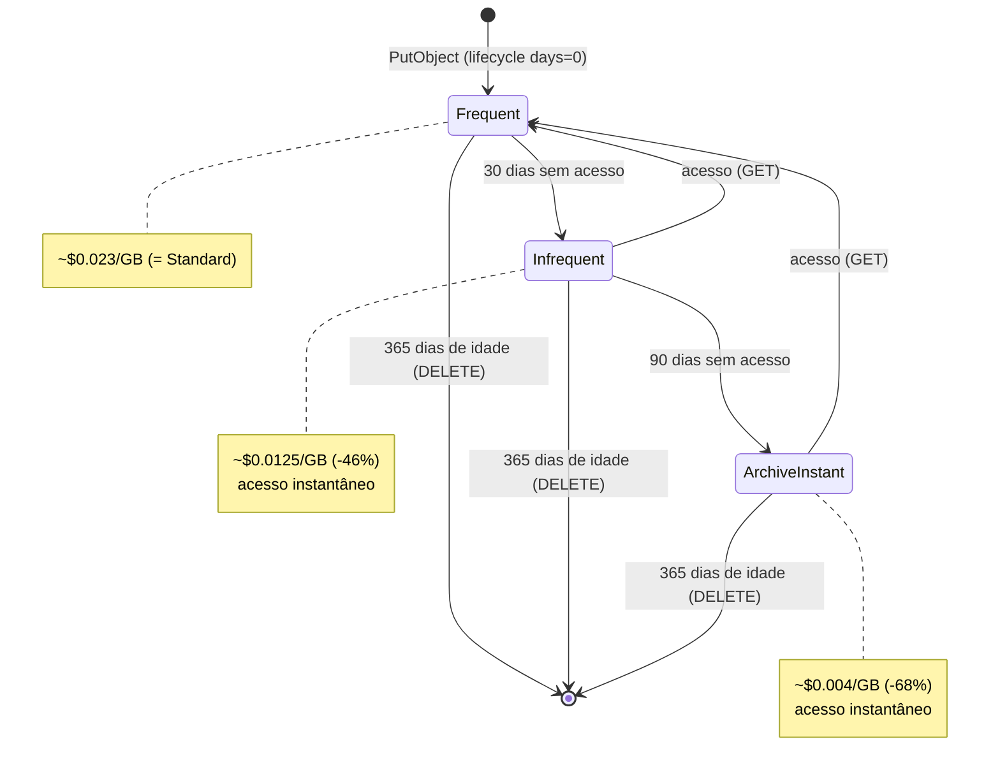

# Arquitetura — go-edge-cache

CloudFront Media Proxy com cache em S3 e fallback via Lambda (Go). Serve mídia
imutável (identificada por `sysid`) por uma CDN com signed URLs. No cache miss,
uma Lambda busca o artefato na origem, grava em `/cdn/` e redireciona o cliente
para a URL assinada.

> Diagramas em [Mermaid](https://mermaid.js.org/) — renderizam direto no GitHub.

> **Origem:** no mundo real a origem é a **API do ServiceNow**, que fornece os
> artefatos para download. Na PoC atual ela é simulada por um bucket S3 (download
> bucket-to-bucket). Diferenças relevantes estão anotadas nos diagramas — em
> especial, a API do ServiceNow **não** expõe `HEAD`, então a guarda de existência
> (404) e tamanho (413) feita hoje via `HeadObject` é específica da PoC.

## Componentes

| Componente | Papel |
|---|---|
| **CloudFront** | CDN com signed URLs (trusted key group). OAC sigv4 para S3 e Lambda. |
| **Origin Group** | S3 como origem primária; failover para a Lambda nos status `403, 404, 500, 502, 503, 504`. |
| **S3 `/cdn/`** | Cache de objetos servidos. Intelligent-Tiering + expiração de 365 dias. |
| **Lambda fallback** | Em cache miss: lock distribuído → valida origem → download → upload streaming → 302. |
| **ServiceNow API** | Origem real dos artefatos (download). **PoC:** simulada por um bucket S3 lido bucket-to-bucket. Sem `HEAD` e sem Range — download all-or-nothing. |
| **Secrets Manager** | Chave privada de assinatura (rotacionada por `go-edge-key-management`). |

## Fluxo de requisição (sequência)

**Pontos-chave do fluxo:**

- O **lock é adquirido antes** da checagem de cache — serializa requisições
  concorrentes pelo mesmo `path`, evitando downloads duplicados da origem.
- O `isCached` dentro da Lambda cobre a corrida em que outra invocação populou
  `/cdn/` enquanto esta esperava o lock.
- `checkOrigin` é a **dupla guarda** da origem: 404 (não existe) e 413 (maior que
  o limite). Na PoC isso é um `HeadObject` único no S3, evitando um `GetObject`
  desperdiçado. Como a **API do ServiceNow não tem `HEAD`**, em produção essa
  validação passa a vir dos headers/metadata da própria resposta de download.
- A Lambda **não devolve o corpo**: retorna `302` para a signed URL. O cliente
  re-requisita e aí o objeto já está em `/cdn/`, servido pelo S3.
- `ReleaseLock` usa `context.Background()` fresco (o ctx da invocação pode estar
  cancelado por timeout/SIGTERM no momento do `defer`).

### TTLs de cache de erro (CloudFront)

| Status | TTL | Racional |
|---|---|---|
| 404 | 300s | arquivo não existe na origem; improvável aparecer em 5 min |
| 403 | 60s | auth temporário; pode resolver após rotação de chave |
| 500 | 10s | erro interno da origem; retry rápido |
| 502 | 30s | conectividade; aguarda recuperação |
| 503 | 10s | origem sobrecarregada; retry rápido |
| 504 | 60s | timeout; origem lenta, não adianta retry imediato |

## Ciclo de vida do objeto em `/cdn/`

Dois relógios independentes: o tiering interno do Intelligent-Tiering (por
**último acesso**, reseta a cada GET) e a expiração do lifecycle (por **idade**,
não reseta).

- Os 3 tiers são **instant access** (sem `restore`, sem retrieval fee). Os tiers
  assíncronos (Archive / Deep Archive) **não** são habilitados — exigiriam
  restore, incompatível com CDN.
- Thresholds de 30/90 dias são **fixos da AWS** (não configuráveis). O DELETE de
  365 dias é nosso (`s3_cache_cleanup_days`).
- O DELETE é por idade, não por frieza: como o conteúdo é imutável, deletar e
  forçar redownload pontual é seguro.

Detalhes de risco e custo em [risk-mitigation-plan.md](risk-mitigation-plan.md).
